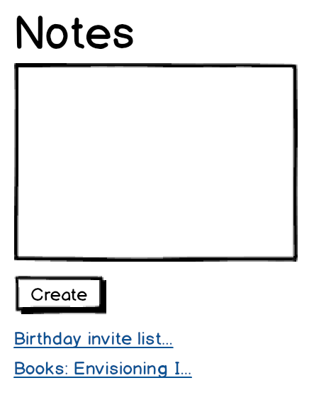

Note Application
-----------------
## Running the code

```
npm start
```
Visit localhost:8080

## Running the tests

Clone or download this repo
Copy the full path for SpecRunner.html
Open the path in your favourite browser.

## Challenge

To TDD and spike a single-page web application in JavaScript using our own testing framework. The following user stories helped to direct the features for the application:

```
As a programmer
I can see a list of my notes, where each note is abbreviated to the first 20 characters
So I can find the one I want

As a programmer
I can create a new note
So I can record something I need to remember

As a programmer
I can see the full text of an individual note on its own page
So I can see all the information in the note
```

## Mockup



## Design Decisions

The challenge required us to test our production code with our own testing framework. I added a describe block an assert object and a double to help structure my tests. The double needs some further work to make it truly eliminate dependency from the rest of my production code. At the moment, it relies on inheritance to access the methods of the item it is mocking.

I would also like to add some more assertion methods to test the functionality of the production code.

The challenge was built around the modular pattern - I decided to write my modules as classes once I felt confident creating modular patterns in JS.

I have kept in one example of the modular pattern for my own reference in the single-note-view model.

With more planning we could have avoided having such a chunky controller. More diagramming and planning could and helped to avoid the difficulty of the next steps - TDD'ing refactoring the controller.

I also decided to separate the html file where I would keep my tests and to mirror the html of the production code there in order to keep them working properly. Splitting out the tests might lead to further confusion. I was very glad that I kept tests for each module separately as it made it much easier to refactor them and move them around.

## Future Additions

* To refactor the controller into separate modules
* To add and improve tests for controller
* To add more functionality to my testing framework
